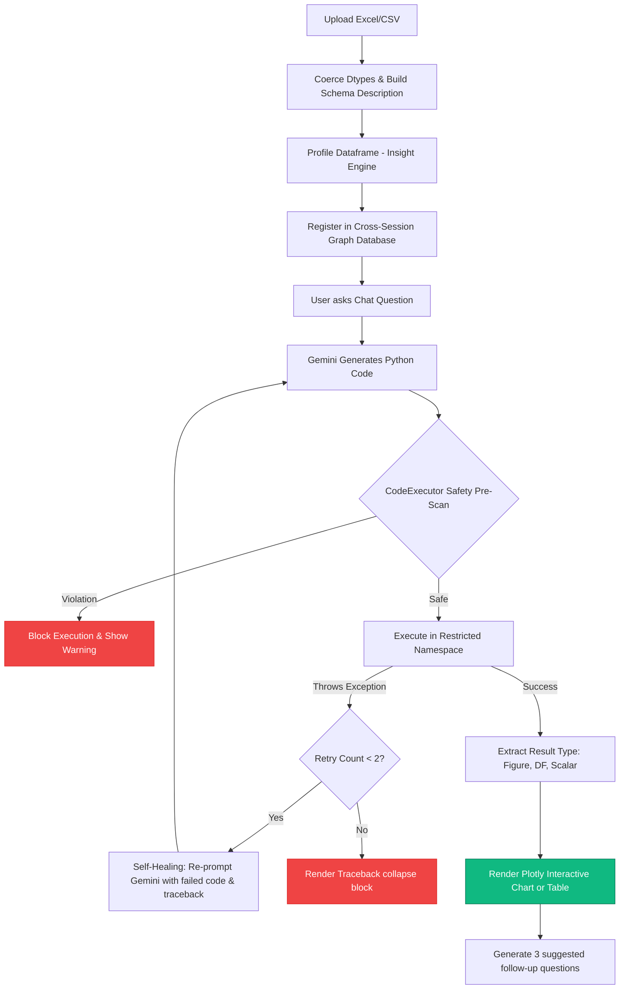

# 📊 Lumina: AI-Powered Spreadsheet Chatbot & Analyst

Lumina is a modern, production-grade conversational data analyst for Excel and CSV spreadsheets. Simply upload your files and ask questions in plain English. Lumina automatically writes, compiles, and safely executes Python code to generate **interactive tables**, **KPI metrics**, and **dynamic charts** powered by **Google Gemini** with a **sandboxed Python execution environment**.

---

## 📐 System Architecture & Pipeline Flow

Lumina uses a hybrid RAG (Retrieval-Augmented Generation) and Code-Generation pipeline with an integrated **self-healing execution loop**:



---

## 🛠️ Step-by-Step Installation Tutorial

### 1. Prerequisites
Ensure you have **Python 3.10+** installed on your system.

### 2. Clone the Repository
Open your terminal and clone the folder:
```bash
git clone https://github.com/rajivchandak25/Lumina.git
cd Lumina
```

### 3. Create a Virtual Environment & Install Dependencies
```bash
# Create environment
python -m venv .venv

# Activate on Windows:
.venv\Scripts\activate

# Activate on macOS/Linux:
source .venv/bin/activate

# Install required packages
pip install -r requirements.txt
```

### 4. Configure Environment Variables
Copy `.env.example` to `.env` in the root folder:
```bash
cp .env.example .env
```
Open `.env` and enter your Gemini API Key:
```env
GEMINI_API_KEY=AIzaSy...your_key_here
GEMINI_MODEL=gemini-2.0-flash
```
> 💡 *Need a key? Create one for free on the [Google AI Studio Console](https://aistudio.google.com/app/apikey).*

### 5. Launch the Dashboard
Run the Streamlit application:
```bash
streamlit run app.py
```
Open the local server URL (usually **`http://localhost:8501`**) in your browser.

---

## 📖 Component Walkthrough & Tutorials

Here is a deep-dive breakdown of the core modules driving Lumina:

### 1. Conversational Chat Pipeline (`pages/1_Chat.py`)
This dashboard page manages the conversational stream, rendering user messages and running the assistant code-generation.
* **Self-Healing Loop**: If generated code fails with a syntax error or runtime traceback, Lumina catches it and runs `generate_retry()` inside [gemini_llm.py](./gemini_llm.py), feeding the error details back to Gemini to automatically correct itself. It allows up to 2 retries before displaying a technical failure.
* **Interactive Export**: Includes widgets to download results as cleaned Excel tables (`xlsxwriter` / `openpyxl`) or conversation transcripts in Markdown format.

### 2. Sandboxed Code Execution (`code_executor.py`)
Safety is critical when executing LLM-generated code. [code_executor.py](./code_executor.py) implements a strict local sandbox:
* **AST Pre-Scan**: Parses code into an Abstract Syntax Tree (AST) using Python's `ast` module. Walks the nodes to block import statements (`os`, `sys`, `subprocess`, etc.) and restricted built-in methods (`exec`, `eval`, `open`, etc.).
* **Restricted Globals**: Executes the code block with a customized `__builtins__` dict that allows only safe primitives (`abs`, `list`, `len`, `dict`, etc.) and disables dangerous system accesses.
* **Namespace Isolation**: Runs on a deep-copied dataframe `df.copy()` so that the user's base spreadsheet is never mutated, preserving data integrity.

### 3. Dataset Profiling (`insight_engine.py` & `pages/2_Insights.py`)
On file upload, [insight_engine.py](./insight_engine.py) profiles the dataset:
* Detects numerical distribution scales, missing values, skewness, and cardinality.
* Finds top correlated column pairs (Pearson coefficient) and displays structural summary cards.

### 4. Causal Analysis & Forecasting (`pages/4_Predictions.py`)
Uses LLM-powered inference prompts to generate predictions and cause analysis blocks:
* **Predictions**: Examines statistical summaries and highlights 3–5 actionable forecasting trends.
* **Causal Factor Analysis**: Matches correlated pairs to hypothesize the driving factors behind column fluctuations (e.g., how discount rates affect sales volume).

### 5. Relationship Visualizer (`graph_engine.py` & `pages/3_Graph.py`)
Builds a local metadata database of uploaded datasets, linking sheets together. Streamlit renders relationship diagrams showing data joins, schema paths, and primary relationships.

---

## 🧪 Running Unit Tests

Verify local code execution pipelines and sandbox checks by running the test suite:
```bash
pytest tests -q
```
This runs safety assertion checks on `CodeExecutor` to ensure it successfully blocks malicious execution paths.
